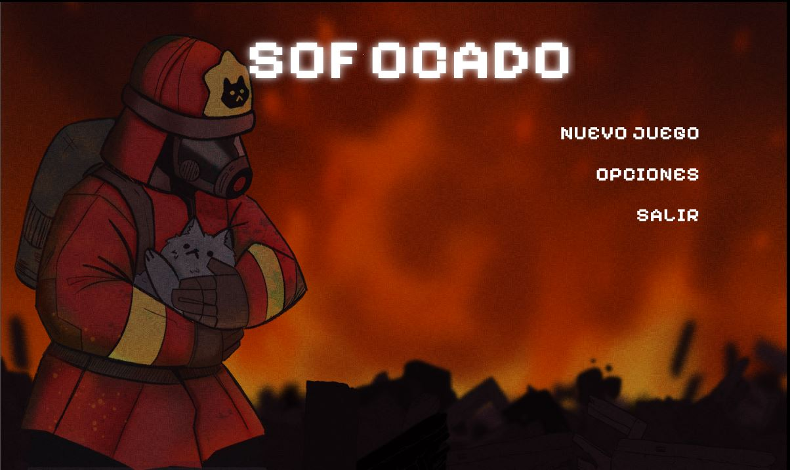
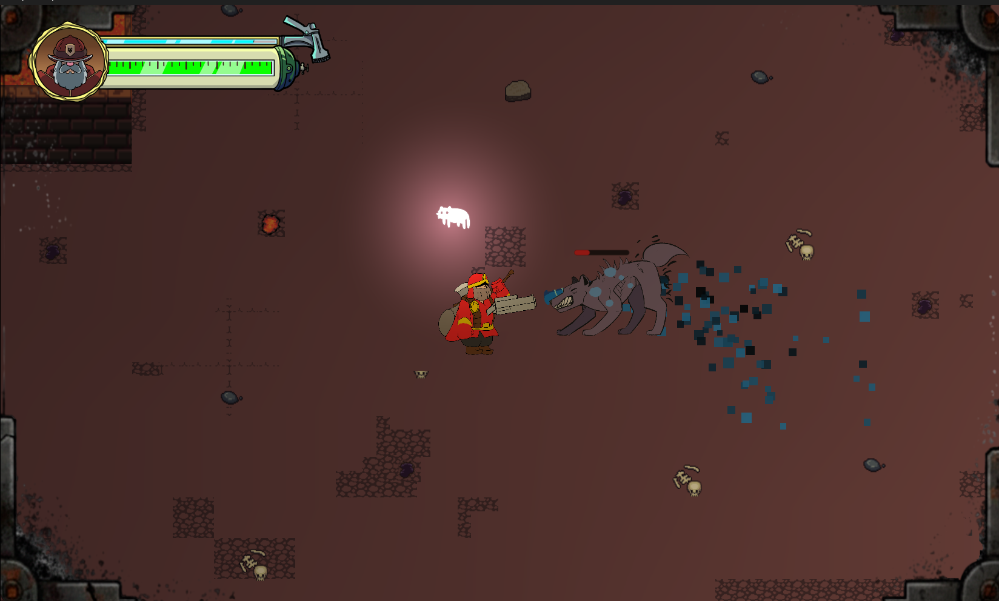
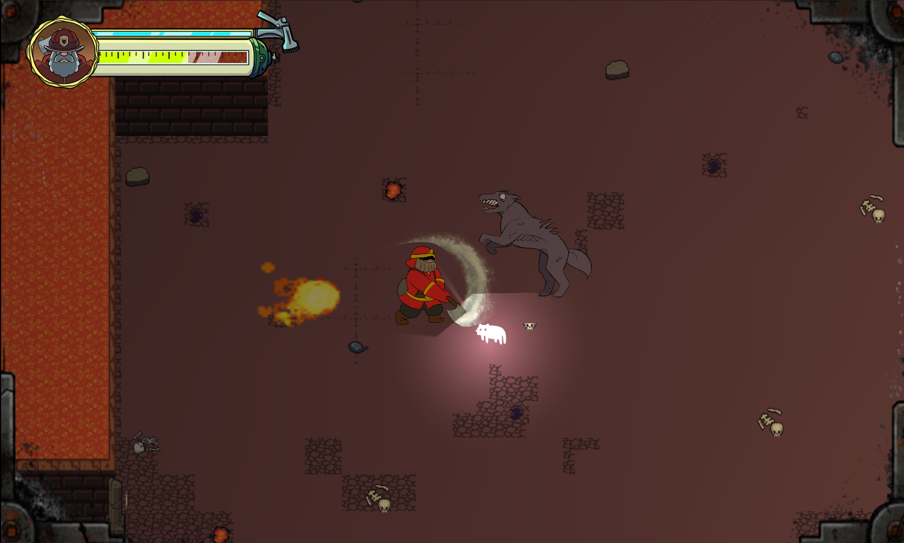
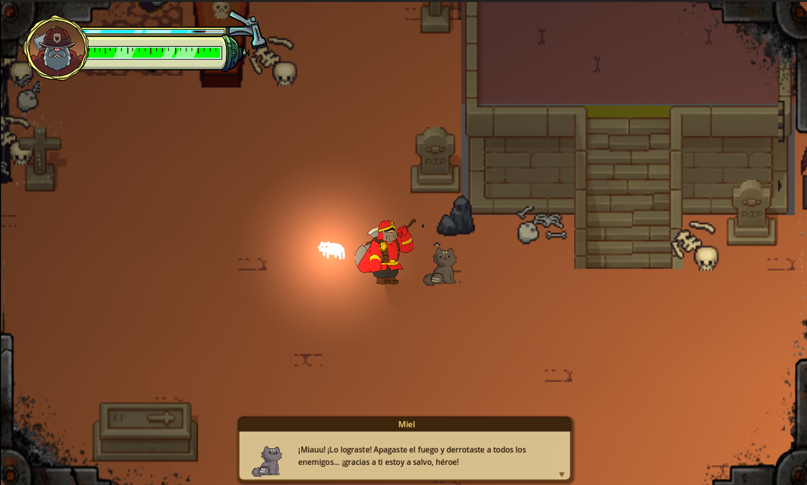
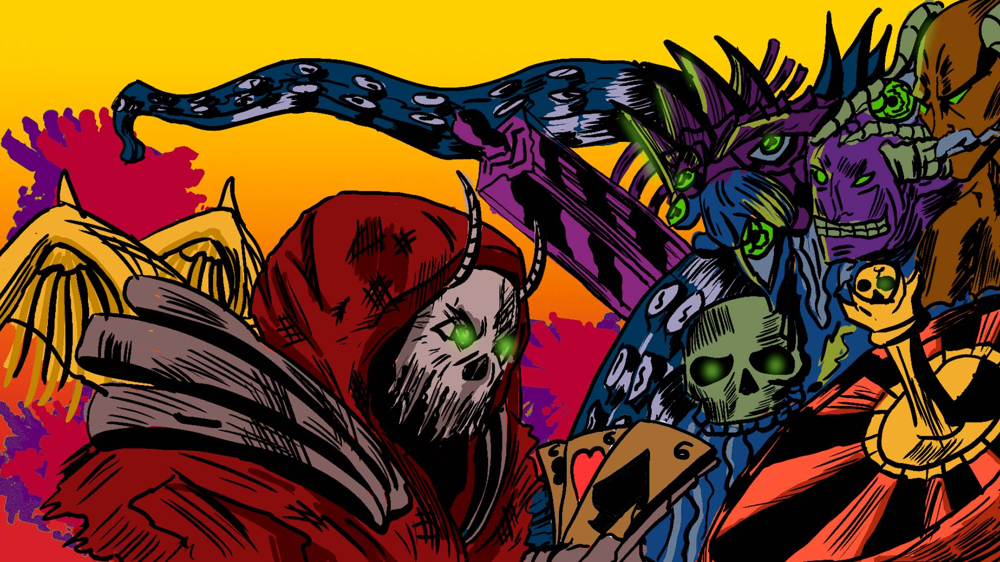

# SOFOCADO

> In Hell, you don't put out fires with water... you extinguish them with acceptance.

**SOFOCADO** es un **Action-Roguelike de terror psicológico** creado en Godot. Encarnas a **Aiden**, un bombero de élite atrapado en el inframundo tras perder a su familia en un incendio sobrenatural. Para encontrar la redención, deberá enfrentar las almas de quienes no pudo salvar y sobrevivir al colapso de su propia mente.

## Descripción

Enfréntate a tus traumas, rescata a los guardianes y sobrevive al humo antes de que el colapso sea definitivo.

El juego mezcla combate táctico, gestión de recursos y una atmósfera opresiva donde el oxígeno, el fuego y la culpa son parte de la misma amenaza.

## Historia

Lucifer convirtió la tragedia de Aiden en una pesadilla eterna. Tras arrasar su hogar y secuestrar a su familia, lo arrastra al inframundo junto a su gato Osiris. Allí, Aiden debe abrirse paso entre incendios sobrenaturales, enemigos hostiles y recuerdos rotos hasta encontrar una salida.

No basta con sobrevivir: hay que **apagar el fuego, derrotar a los enemigos y rescatar a los gatos guardianes** para avanzar.

## Características del build actual

- **Inmersión crítica**: sistema dinámico de oxígeno. Si el aire baja del 30%, el mundo se desatura, el sonido se distorsiona y el pánico altera el gameplay.
- **Combate táctico**: alterna entre el **hacha** y la **manguera de agua** con un cooldown que castiga el error.
- **Gatos guardianes**: localiza y rescata aliados espirituales para desbloquear habilidades físicas y herramientas esenciales.
- **Gestión de recursos**: administra vida, agua, oxígeno y posición para sobrevivir a cada zona.
- **Escenarios y jefes**: niveles variados, incluyendo zonas infernales y enfrentamientos especiales.
- **Guardado/carga**: conserva progreso, estado del jugador y nodos destruidos.
- **Localización**: interfaz disponible en **español, inglés y portugués**.

## Mecánicas principales

### 1. Inmersión crítica
Tu oxígeno funciona como una barra de supervivencia. Cuando baja demasiado, la pantalla se vuelve más agresiva y el estado del personaje empeora.

### 2. Combate táctico
La manguera consume agua mientras la usas. El hacha permite responder cuando los recursos escasean o necesitas un ataque más preciso. El cambio entre armas tiene un **cooldown de 5 segundos**, así que equivocarse en el momento oportuno puede costar caro.

### 3. Gatos guardianes
Los gatos rescatados desbloquean mejoras y herramientas de progreso, reforzando tanto la narrativa como la jugabilidad.

### 4. Progresión por habitaciones
Cada zona puede exigir derrotar enemigos y apagar fuegos antes de permitir el avance.

### 5. Riesgo constante
La habitación pierde vida con el tiempo, así que cada decisión importa.

## Controles

| Acción | Tecla / Botón |
|---|---|
| Moverse | WASD / Flechas |
| Apuntar | Mouse |
| Atacar / parry | Clic izquierdo |
| Cambiar arma | Clic derecho / scroll |
| Dash | Spacebar |
| Interactuar / abrir puertas | F |

> En el tutorial del juego puedes ver los controles completos según la pantalla actual.

## Capturas / Screenshots

  

  

  

  

  

## Tecnología

- **Motor**: Godot 4.5
- **Lenguaje**: GDScript
- **Plataforma objetivo**: PC
- **Estilo**: Action-Roguelike 2D, top-down, terror psicológico

## Cómo ejecutar

1. Abre el proyecto en **Godot 4.5 o superior**.
2. Carga el archivo **project.godot**.
3. Ejecuta la escena principal del menú.

## Estructura general

- **Interfaces**: menús, intro, tutorial, créditos y opciones.
- **Scenes**: niveles, entidades, HUD y efectos visuales.
- **Scripts**: lógica de combate, guardado, HUD, asfixia y gestión de habitaciones.
- **Assets**: sprites, animaciones, música y efectos de sonido.

Proyecto creado por el equipo de  **Arqane Studios**.